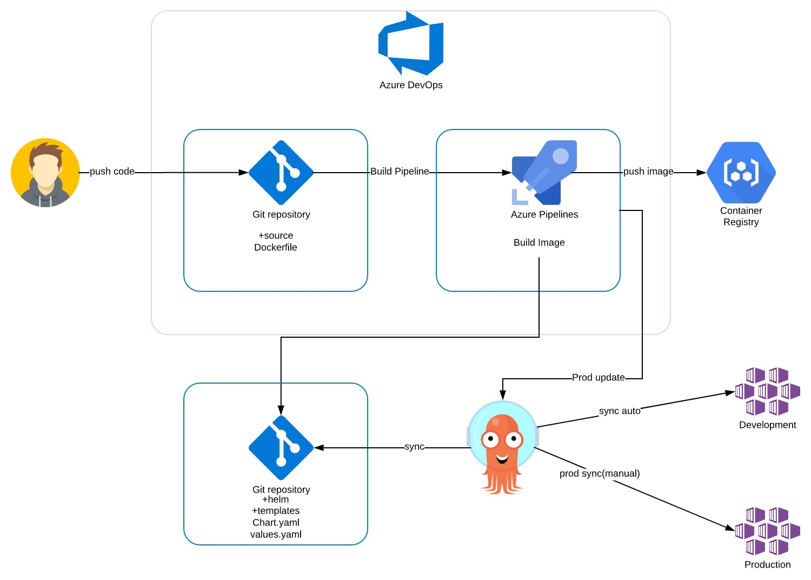

# AKS POC

[](https://github.com/fluxcd/flux2-multi-tenancy/actions)
[](https://github.com/fluxcd/flux2-multi-tenancy/actions)
[](https://github.com/fluxcd/flux2-multi-tenancy/blob/main/LICENSE)

This repository serves as a starting point for managing multi-tenant clusters with Terraform, Git and Flux v2 and Helm charts.

## Pipeline 


You can use the toolkit to extend Flux, or to build your own systems
for continuous delivery -- see [the developer
guides](https://toolkit.fluxcd.io/dev-guides/source-watcher/).


## Repository Structure
```

├── cicd
│   ├── terraform
├── scripts
├── local
├── infrastructure
│   ├── nginx
│   ├── elastic
│   ├── grafana
│   ├── cert-manager
│   ├── redis
│   ├── kyverno
│   └── kyverno-policies
```


## Roles

**Platform Admin**

- Has cluster admin access to the fleet of clusters
- Has maintainer access to the fleet Git repository
- Manages cluster wide resources (CRDs, controllers, cluster roles, etc)
- Onboards the tenant’s main `GitRepository` and `Kustomization` 
- Manages tenants by assigning namespaces, service accounts and role binding to the tenant's apps

**Tenant** 

- Has admin access to the namespaces assigned to them by the platform admin
- Has maintainer access to the tenant Git repository and apps repositories 
- Manages app deployments with `GitRepositories` and `Kustomizations`
- Manages app releases with `HelmRepositories` and `HelmReleases`

The [platform admin repository](https://github.com/fluxcd/flux2-multi-tenancy/tree/main) contains the following top directories:

- **cicd** dir contains YAML file used for Build Pipeline configuration in Azure DevOps portal and Terraform manifests
- **infrastructure** dir contains common infra tools such as admission controllers, CRDs and cluster-wide polices
- **tenants** dir contains namespaces, service accounts, role bindings and Flux custom resources for registering tenant repositories
- **scripts** dir contains varios scripts

**What Is Argo CD?**

Argo CD is a declarative, GitOps continuous delivery tool for Kubernetes.
Application definitions, configurations, and environments should be declarative and version controlled. Application deployment and lifecycle management should be automated, auditable, and easy to understand.


